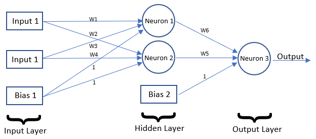
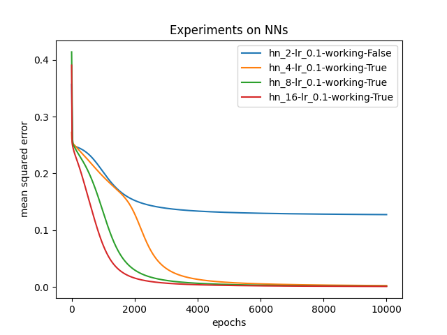

# Neural Networks from scratch
 <br/><br/>
Small library of neural networks created from scratch with python and numpy. <br/>
This project was created during my Master's course at Leiden University. Its purpose was to learn in depth about gradient descent and backpropagation techniques. <br/>
The model architecture allows for the creation of a two layer network with an arbitrary number of inputs, hidden nodes and output nodes.<br/>
The network has been tested by emulating the XOR logic gate.

## Requirements
<ul>
  <li>Python 3</li>
  <li>numpy >=1.19</li>
</ul>

## Usage
To run a single experiment run the file *XOR_experiment.py*
``` 
python XOR_experiment.py
```

To run multiple experiments and get a plot of the results use the file *experiments.py*
``` 
python experiments.py
```

## Observations
It is interesting to notice that when running the network with only two hidden nodes (which is the minimum requirement to emulate the XOR logic gate), the network sometimes fails to learn to simulate XOR. <br/>
In general, this is the result of bad (unlucky) weight initialization that push the network towards local minimums with high convergence rate. The more neurons we add to the hidden layer, the harder it is for weight inintialization to influence the learning of the model. In addition, the more weights are used in the hidden layer, the smoother and faster the descent of the loss becomes over epochs. <br/>
An example of these behaviours can be seen from the generated plots when running *experiments.py* with the seed set as *np.random.seed(0)* (enabled by default).<br/>
The image below is a representation of the above observations:



The labels represent the parameters of the experiments:<br/>
<ul>
  <li><b>hn_<i>int</i></b> : denotes number of hidden nodels in the hidden layer of the network.</li>
  <li><b>lr_<i>float</i></b> : denotes the learning rate used during training. </li>
  <li><b>ok_<i>bool</i></b> : boolean value representing if the test on the network gave the correct results after training.</li>
</ul>

It is obvious that the experiment with two hidden nodes was not able to learn the XOR logic gate properly, converging to a  Mean Squared Error of around 0.15.


## Contributing
Pull requests are welcome. For major changes, please open an issue first to discuss what you would like to change.

## Future Work
- Implement multiple layers in the network.

## References 
<ul>
  <li><b>Deep Learning</b> by Aaron Courville, Ian Goodfellow, and Yoshua Bengio</li>


  <li><b>Hands-On Machine Learning with Scikit-Learn and TensorFlow: Concepts, Tools, and Techniques to Build Intelligent Systems</b> by Geron Aurelien</li>
</ul>


